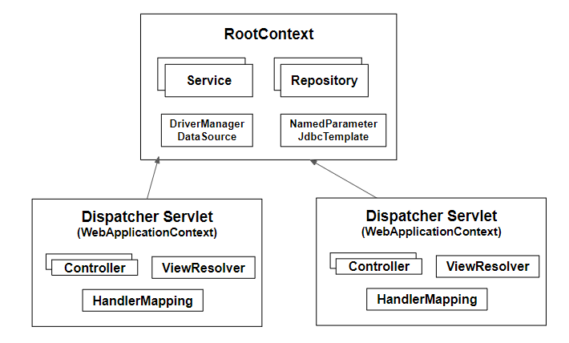

# Java 설정을 통한 Spring 구조 이해하기

기존에는 xml방식으로 Spring 프로젝트를 만들었다. 익숙한 xml 설정은 대략적인 흐름도에 대한 이해만 있었고, 그 내부에 어떤 식으로 환경들을 구성하고
조립되는지에 대해 더 깊은 고민은 해보지 않았던 것 같았다.  

이번 Java Code로 Spring 설정을 통해 Spring의 ServletContext 구조에 대해 조금 더 이해하기 위하여 해당 실습예제를 준비하였다. 

### 1. RootApplicationContext / WebApplicationContext 

  Java 코드로 Spring을 설정하기 전에 먼저 이해해야하는 부분은 RootApplicationContext와 WebApplicationContext이다. 
 
  처음에는 이 두 개의 용어가 Spring의 특별한 것을 일컫는줄 알았다. 특별한 기술용어를 지칭하는 것이 아닌 Spring의 ApplicationContext를
 계층적으로 분리하여 Root(부모)와 Web(자식)으로 나눈 ApplicationContext를 말하는 것이었다.(상속 구조를 생각하면 된다)

위의 그림처럼 여러 개의 WebApplicationContext들은 단 하나의 RootApplicationContext에서 설정된 Bean들을 공유하여 사용한다. 
Spring에서는 왜 이렇게 하나의 Root와 여러개의 Web ApplicationContext를 만들 수 있도록 제공하였을까? 
당연히 확장성 때문이다. 각 레이어간의 책임 및 역할을 생각해보면, 왜 그림과 같은 구조로 만들었는지 어느정도 이해할 수 있었다. 
 
 일반적으로 Java WebApplication 구조는 Client에 UI 랜더링, 컴포넌트를 처리하는 Presentation Layer, 비즈니스 로직을 처리하는 Business Layer, Database에 접근하는 Data Access Layer로 구성되어 있다. 
 여기서 RootApplicationContext는 Business Layer와 Data Access Layer에 필요한 Bean 생성과 관계설정등에 대한 설정 내용을 담고 있고,
 WebApplicationContext는 Presentation Layer인 SpringMVC와 관련된 설정 내용을 담고 있다. 
 
 데이터의 처리와 정합성, 트랜잭션의 일관성 등을 유지해야하는 Business Layer, Data Access Layer를 굳이 두개를 만들어 중복이 허용되도록 할 필요는 없을 것 같다.
 상대적으로 Client와 가장 밀접한 Presentation Layer는 다양한 Client에 필요한 부분을 맞춰줘야하기 때문에 WebApplicationContext를 여러개를 두지 않았나라는 생각이 든다.
 
 

### 2. ServletContext 설정 및 Servlet 생성과정
Servlet 3.0 이상부터는 xml대신 Java 코드로 Web과 관련된 설정이 가능하다. Spring에서는 web 설정을 지원 해줄 수 있는 몇 개의 인터페이스를 제공한다.
그 중에서 좀 더 Servlet 설정에 직관적으로 보이는 WebApplicationInitializer를 선택하였다. 

아래는 web.xml을 대신하여 Java 코드로 구현한 Spring의 Servlet 설정 방식이다. 
  
~~~JAVA
 public class ServletInitConfig implements WebApplicationInitializer {
 
     @Override
     public void onStartup(ServletContext container) {
 
         //① RootApplicationContext 생성 및 설정정보 등록
         AnnotationConfigWebApplicationContext rootContext = new AnnotationConfigWebApplicationContext();
         rootContext.register(RootAppConfig.class);
 
         //② RootApplicationContext 라이프사이클 설정
         container.addListener(new ContextLoaderListener(rootContext));
 
         //③ WebApplicationContext 생성 및 설정정보 등록
         AnnotationConfigWebApplicationContext dispatcherContext = new AnnotationConfigWebApplicationContext();
         dispatcherContext.register(WebAppConfig.class);
 
         //④ DispatcherServlet 생성 및 기타 옵션정보 설정
         ServletRegistration.Dynamic dispatcher = container.addServlet("dispatcher", new DispatcherServlet(dispatcherContext));
         dispatcher.setLoadOnStartup(1);
         dispatcher.addMapping("/");
        
     }
}
 ~~~
 **WebApplicationInitializer** 인터페이스를 구현하면 **onStartup** 메서드가 만들어진다. **onStartup** 메서드의 인자값을 확인해보면 ServletContext타입의 변수를 파라미터로 받는것을 확인 할 수 있다.
 변수명도 container인걸 보니, Servlet container를 **초기화**하는 메서드이다.
 
 (여기서, ServletContext타입의 변수는 누가 던져 주는 것일까? SpringServletContainerInitializer라는 SPI(Service Provider Interface)인데 이 API가 자동으로 감지하여 컨테이너에 부트스트랩 한다고한다. 이 부분은 나중에 공부해봐야 겠다.)
 
 대략 위에서 아래로 훓어만 봐도 Root와 Web의 ApplicationContext 생성과 설정, 그리고 DispatcherServlet을 설정한다는 것을 알 수 있다. 
 
  **[ RootApplicationContext 생성 및 설정 살펴보기 ]**
 
 ① RootApplicationContext 생성 및 설정정보 등록
 
  ~~~JAVA
@Configuration
@ComponentScan(basePackageClasses = {MysqlConfig.class, MemberRepository.class, MemberService.class})
public class RootAppConfig {

    @Bean
    public ObjectMapper objectMapper(){
        return new ObjectMapper();
    }

}
  ~~~
  RootApplicationContext에 등록된 Bean들에 대한 설정코드이다. ComponentScan을 사용하여 Service, Repository, Db설정정보들을 
  rootContext에 등록하였다.
  
 ② RootApplicationContext 라이프사이클 설정
 
  1번의 설정정보가 담긴 rootContext를 ServletContext의 addListener메서드를 통해 ContextLocaderListener 인스턴스 생성자 파라미터로 담아 등록하였는데
  이 부분이 어떻게 라이프사이클을 결정짓는지 확인해보자. 
  
  먼저 ContextLoaderListener를 살펴보겠다.
  

    
  ContextLoaderListener는 ServletContextListener 인터페이스의 구현체이자 ContextLoader 클래스를 상속한 클래스이다.
 
 **ContextLoaderListener 클래스**
~~~JAVA
public class ContextLoaderListener extends ContextLoader implements ServletContextListener {
    public ContextLoaderListener() {
    }

    public ContextLoaderListener(WebApplicationContext context) {
        super(context);
    }

    public void contextInitialized(ServletContextEvent event) {
        this.initWebApplicationContext(event.getServletContext());
    }

    public void contextDestroyed(ServletContextEvent event) {
        this.closeWebApplicationContext(event.getServletContext());
        ContextCleanupListener.cleanupAttributes(event.getServletContext());
    }
}
~~~
위의 클래스다이어그램과 ContextLoader 클래스의 내용들을 우선 대략적으로 분석해봤다.

첫번째, ServletContextListener의 두 개의 메서드를 오버라이드한 contextInitialized와 contextDestroyed 메서드를 구현한게 보인다. 메서드명을 살펴보면 이 두 개의
메서드가 RootApplicationContext의 LifeCycle을 담당하는 것을 알 수 있다. 

두번째,  최상위 계층인 EventListener 인터페이스가 있다. 이 인터페이스는 어떠한 구현체도 없는 마커 인터페이스이다. 
ServletContext의 addListener 메서드를 확인해보면 EventListener 타입의 인자값을 받는것을 확인 할 수 있다. 

RootApplicationContext의 eventlistener 설정을 통해 라이프사이클 설정을 한 이유는 컨테이너 생성 시에는 RootContext를 생성해야 Bean들을 사용할 수 있으며,
Destoryed될 때에는 메모리해제를 위해 정상적으로 종료가 되야하기 때문이다. 

 
   **[ WebApplicationContext 생성 및 설정 살펴보기 ]**
 ③ WebApplicationContext 생성 및 설정정보 등록
 ~~~JAVA

@Configuration
@EnableWebMvc
@ComponentScan(basePackageClasses = MemberController.class)
public class WebAppConfig implements WebMvcConfigurer {

}
 ~~~
 @EnableWebMvc 어노테이션은 Spring의 기본설정들을 담고 있다. (MessageConverter나 ViewResolvers 등 ..) 추가로 Controller를 스캔하여 
 SpringMVC 구조의 Bean들을 설정하였다. 
  
 ④ DispatcherServlet 생성 및 기타 옵션정보 설정
  ServletContainer에 DispatcherServlet을 생성 후, setLoadOnStartup 부분을 볼 수가 있다. 서블릿은 서버가 올라가게 되면, 최초 request 요청이 들어올 때
  초기화가 되는데, 이럴 경우 처음 사용자는 서비스에 불편을 겪게된다. 그래서 서버가 스타트되면 바로 초기화 과정이 이루어질 수 있도록 setLoadOnStartup 메서드를 사용한다.
  숫자가 0과 같거나 클 경우 해당되며, 동작방식은 ServletContext가 초기화 단계 동안 ServletContextListener 객체의 contextInitialized 메서드를 호출하여 Servlet을 인스턴스화하고
  초기화한다. 
  (ContedxtLoaderListener 클래스다이어그램 참고) 
  
  
###3. RootApplicationContext와 WebApplicationContext의 관계  

3. 정리
 - Spring은 확장성을 위하여 ApplicationContext를 계층적으로 나누었다. 나눈 기준은 객체지향관점에서 변하는 것과 변하지 않는 부분을 
 나누어 RootApplicationContext와 WebApplicationContext를 분리하였다.
 
 -   

[정리]
두서없이 정리된 점이 없지 않아 있다. 설정하고 디버깅하면서 더 궁금하고 모르는 부분이 나왔는데 내용이 산으로 갈까봐 하나의 주제에 집중해서 정리하였다.
Spring의 ApplicationContext의 계층구조에 대한 이해와 Spring의 Servlet 설정방식에 대해 얕게나마 알 수 있었다. 

부족하지만 긴 글 읽어주셔서 감사합니다.

[Reference]

https://spring.io/

https://www.technicalkeeda.com/spring-tutorials/spring-4-jdbctemplate-annotation-example

https://www.baeldung.com/spring-xml-vs-java-config

https://jhgan.tistory.com/40

https://www.baeldung.com/spring-web-contexts

https://dzone.com/articles/understanding-spring-web

https://docs.spring.io/spring/docs/3.2.x/spring-framework-reference/html/mvc.html

  
 

 

 

